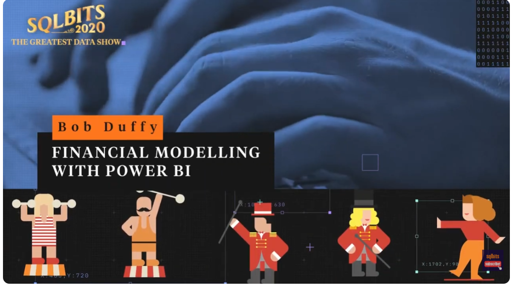
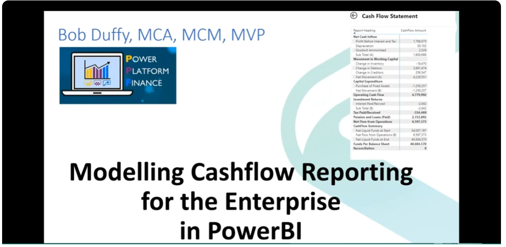

# Financial Modelling with Power BI (2026)

Welcome to our updated sample site for Financial Modelling with Power BI.

This repos contains some of out widely adopted design patterns for Enterprise Financial Modelling 
in PowerBI

You can either download content here or cloen the repos and link it to a Workspace in Power BI.
If you have a large/complex project and want help with the modelling you can also contact as at 
(info@prodata.ie)

## Contents

- **Sample Power BI PBIX with P&L, BS and CF**  
  [Finance-GL.pbix](./Files/Finance-GL.pbix)

- **Sample Power BI PBIX for AR Modelling**  
  [Finance-AR.pbix](./Files/Finance-AR.pbix)

- **Sample GL files to import into Power BI (General Ledger & Transactions)**  
  [Files Folder](./Files)

- **Sample SQL Scripts to create AR SQLDB Data**  
  [Files Folder](./Files/AR%20Scripts/)

- **Sample business rules spreadsheet (GL → Statement mapping)**  
  [Statement.xlsx](./Files/Statement.xlsx)

- **V1 Content using the Statement Bridge (2016–2025)**  
  [V1 Folder](./V1)

---

## SQLBits Session (V1 Design)
Want to see the original design pattern in action?

🎥 [Watch the SQLBits session](https://www.youtube.com/watch?v=hoGI1iNb9k0)

This session walks through the **Statement Bridge approach (V1)** and the thinking behind the model.

## Cashflow Reporting (V1)

🎥 [Watch the video on Cashflow Reporting](https://www.youtube.com/watch?v=9iuW-zJvleQ&t=5s)

---
Feel free to download and explore.

This design pattern has already been proven across multiple ERPs, including:
- SAP  
- M3  
- Dynamics  
